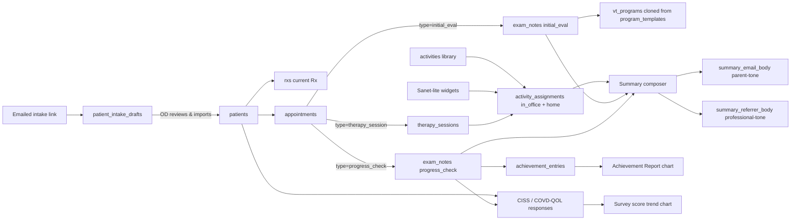

# Behavioral Optometry App — Plan

## 1. Scope decisions (defaults I'm assuming — change at review if wrong)

- **Tenancy**: single-practice with `practice_id` on every row, RLS by `practice_id`. Multi-practice SaaS is a future flip, not a rewrite.
- **Email**: v1 renders an email body in-app, stores it on the appointment, copy-to-clipboard / open default mail client. Resend-via-Supabase-Edge-Function is documented as v2.
- **No HIPAA-grade infra** in v1 (Supabase EU region, RLS, signed audit log table) — fine for a personal-project MVP, called out as a known limit.
- **One OD user first**; schema supports inviting a therapist/receptionist later (`profiles.role`).

## 2. Tech stack (mirroring [LangTutor/package.json](LangTutor/package.json))

- Vite + React 19 + TS, `pnpm`
- Supabase JS, Google OAuth (`signInWithOAuth({ provider: 'google' })`, copy from [LangTutor/src/lib/auth.tsx](LangTutor/src/lib/auth.tsx))
- `@tanstack/react-query`, `react-router-dom` v7
- shadcn/ui on Tailwind v4 + Radix, `sonner`, `lucide-react`
- `react-hook-form` + `zod` — _new vs LangTutor_; non-negotiable for the long exam forms
- `date-fns` — appointment date math
- `@react-pdf/renderer` _(optional, v1.1)_ — printable parent summary

## 3. Domain model (Supabase schema, source of truth in `supabase/schema.sql`)

```sql
-- profiles: 1 row per auth user, owns a practice
profiles(id uuid pk → auth.users, practice_id uuid, role text check in ('od','therapist','staff'), full_name text, ...)
practices(id uuid pk, name text, owner_id uuid → auth.users, ...)

patients(id, practice_id, first_name, last_name, dob, sex, email, phone,
         guardian_name, guardian_email, guardian_phone,
         school, grade, referral_source, chief_complaint,
         allied_health_notes, created_at)

rxs(id, patient_id, captured_at,
    od_sph, od_cyl, od_axis, od_add, od_prism, od_base,
    os_sph, os_cyl, os_axis, os_add, os_prism, os_base,
    pd, notes)            -- many per patient; "current" = latest by captured_at

referrers(id, practice_id, name, role, email, phone, notes)
patient_referrers(patient_id, referrer_id)

appointments(id, practice_id, patient_id, starts_at, duration_min,
             type text check in ('initial_eval','therapy_session','progress_check','consultation','follow_up'),
             status text check in ('scheduled','in_progress','completed','no_show','cancelled'),
             summary_email_body text,        -- parent-facing, generated then edited
             summary_referrer_body text,     -- professional tone, optional
             summary_email_sent_at timestamptz)

exam_notes(id, appointment_id, template_key text,
           data jsonb, free_text text, updated_at)

-- Activity / exercise library (first-class entity, seeded from JSON)
activities(id, practice_id nullable,            -- null = built-in/system, non-null = practice-custom
           key text unique,                     -- 'brock_string', 'marsden_ball', 'hart_chart', ...
           name text, category text,            -- vergence|accommodation|tracking|saccades|stereopsis|visual_motor|visual_processing
           description text, instructions text,
           levels jsonb,                        -- [{label, params}] e.g. [{label:'20cm', params:{distance:20}}]
           default_frequency text,              -- '5 min nightly'
           demo_video_url text,                 -- YouTube embed
           printable_pdf_url text)

-- Per-session log: which activities were done in-office (richer than the old jsonb)
activity_assignments(id, therapy_session_id, activity_id,
                     mode text check in ('in_office','home'),
                     level_label text, duration_min int,
                     performance int,             -- 1-5
                     observations text,
                     widget_run_id uuid nullable) -- link to in-office widget result if any

therapy_sessions(id, appointment_id,
                 in_office_observations text,
                 -- activities now live in activity_assignments
                 created_at)

-- Diagnosis-driven program templates (seeded JSON; clone-on-use)
program_templates(id, key text unique,             -- 'convergence_insufficiency', 'accommodative_dysfunction', ...
                  name text, diagnosis text,
                  duration_weeks int,
                  goals jsonb,
                  weekly_plan jsonb)               -- [{week, focus, activities:[activity_key…]}]

vt_programs(id, patient_id, started_at, ended_at,
            diagnosis text, goals jsonb,
            source_template_key text nullable)     -- which template it was cloned from

-- Validated symptom surveys (CISS, COVD-QOL, etc.)
surveys(id, key text unique,                       -- 'ciss', 'covd_qol'
        name text, items jsonb,                    -- [{key, prompt, scale:0..4}]
        scoring jsonb)                             -- {method:'sum', cutoffs:[{value:21, label:'symptomatic'}]}

survey_responses(id, patient_id, survey_key text,
                 captured_at, answers jsonb,       -- {item_key:int}
                 score int, score_label text)

achievement_entries(id, patient_id, vt_program_id, captured_at,
                    category text,                  -- 'reading'|'academic'|'emotional'|'ocular_symptoms'|'localization'|'goals'
                    item text, scale int)

-- File attachments — schema present, but UI submit is DISABLED in v1
attachments(id, patient_id, appointment_id nullable,
            storage_path text, filename text, mime text, size_bytes int,
            uploaded_at, uploaded_by uuid)

-- Patient self-serve intake via emailed magic link
intake_links(id, practice_id, patient_id nullable,    -- nullable: pre-create-patient case
             token text unique, email text,
             expires_at, used_at)
patient_intake_drafts(id, intake_link_id, payload jsonb,  -- full intake form answers
                      submitted_at, reviewed_at, imported_patient_id uuid nullable)

audit_log(id, practice_id, actor_id, action text, target_table text, target_id uuid, at timestamptz)
```

RLS pattern: `using (practice_id = (select practice_id from profiles where id = auth.uid()))` on every table.

## 4. Routing & layout

Mirror [LangTutor/src/App.tsx](LangTutor/src/App.tsx) — `<AuthProvider>` + `<ProtectedRoutes>` + sidebar `Layout` with `<Outlet/>`. Routes:

- `/login`
- `/` → Today dashboard
- `/patients` (list, search) → `/patients/:id` (profile + tabs: Overview / Appointments / VT Program / Achievement / Files)
- `/calendar` (week view + day view)
- `/appointments/:id` (the visit screen — type-aware tabs, exam notes, summary email composer)
- `/settings` (practice info, exam templates, email templates)

Sidebar nav items (lucide icons): Today, Calendar, Patients, Settings.

## 5. The features that make this app _not_ a generic EHR

1. **Appointment-type-driven templates**. Opening an `initial_eval` appointment loads a structured form (acuity, refraction, cover test, NPC break/recovery, vergence ranges BI/BO at distance + near, accommodation amp/facility/lag, pursuits, saccades DEM/King-Devick, stereopsis, visual processing). Opening a `therapy_session` loads activity logger + home-exercise prescriber. Templates are JSON in `supabase/exam_templates/` so they're versioned in git.

2. **Activity library — first-class entity**. Both in-office sessions and home plans pull from the same `activities` table. Each activity: name, category, levels, written instructions, **YouTube demo URL**, optional printable PDF. Seed with ~25 standard items: Brock string, Marsden ball, Hart chart, vectograms, pegboard rotator, Wolff wand, aperture rule, plus/minus flippers, red/green letters, yoked prism walking, near-far rock, etc. Detail view embeds the demo video.

3. **In-app Sanet-lite activity widgets**. Small Canvas/SVG widgets the OD can open fullscreen on a second monitor or tablet during the session:
   - **Metronome** (BPM, with click + visual flash; for Brock-string pacing)
   - **Tachistoscope** (digit/letter/word flash, configurable duration 50–500 ms)
   - **Saccade dots** (2-point / 4-corner targeting, configurable interval)
   - **Smooth pursuits path** (figure-8, lazy-8, circle; speed slider)
   - **Hart chart digital** (configurable rows, near & far)
   - **Visual reaction time** (tap-when-target-appears, logs ms)

   Each widget exposes "log result" → writes an `activity_assignments` row tagged to the current `therapy_session`.

4. **Therapy session activity log with carry-over**. Last session's plan pre-fills as a starting point. Each activity has level, duration, performance 1–5, observations. Carries the `widget_run_id` from the in-app widgets when used.

5. **Home-exercise prescriber → printable / emailable plan with videos**. Pick from the activity library, set frequency/duration, generate a one-pager for the parent with **embedded YouTube demo videos** for each prescribed activity.

6. **Validated symptom surveys**. JSON-driven survey engine, shipping with **CISS** (15-item, sum-score, cutoff 21 = symptomatic) and **COVD-QOL**. Auto-score on submit, store in `survey_responses`, plot score-over-time per patient. New surveys = adding a JSON file.

7. **Diagnosis-driven program templates**. Pre-built 6–12 week skeletons for the common diagnoses behavioral ODs treat: convergence insufficiency, accommodative dysfunction/infacility, oculomotor dysfunction, amblyopia, post-concussion vision syndrome. "Start program from template" clones into `vt_programs` and pre-fills the first session.

8. **Achievement Report**. Multi-category scale (reading, emotional/behavioral, academic, ocular symptoms, localization, goals). Captured at intake + every progress check. Renders as a **diverging bar comparison chart** baseline vs latest. This is what parents want to see.

9. **Parent-friendly post-visit summary composer + referrer copy**. Reads exam_notes + therapy_sessions, runs through a template, produces plain-language email body ("Today we worked on convergence — Maya's NPC improved from 12cm to 8cm. Please practice the Brock string nightly for 5 min."). Editable, then copy/open-in-mail-client. A second tab regenerates the same content in a **professional tone for the referrer** (teacher / OT / pediatrician / neurologist from the referrer directory). Both stored on the appointment.

10. **Patient self-serve intake form**. OD clicks "send intake form" on a new patient → app generates a single-use magic-link token → email body with the link → parent fills out the long form at home → arrives as a `patient_intake_drafts` row the OD reviews + imports into the patient record. Public route `/intake/:token`, no auth.

11. **Session timer** (live during the appointment). Top-of-screen countdown for total session length + a configurable "ping every N min" toast that says "log this activity result?". Pure client state, no DB writes.

12. **Current Rx tracker**. Per-patient `rxs` history with full sph/cyl/axis/add/prism/base for OD & OS plus PD. "Current Rx" pill always visible on the patient profile.

### UI-only (no backend) in v1 — clearly stubbed

- **File attachments**: drag-and-drop zone + file list, but the submit button is disabled with a "Storage coming soon" tooltip. Schema (`attachments`) is in place so wiring it later is a one-day job.
- **Voice dictation**: a mic button on every long free-text field; click shows a toast "Voice dictation coming soon". No Web Speech API wiring yet.

## 6. Information flow



## 7. Source layout (mirrors LangTutor conventions)

- `src/lib/supabase.ts`, `src/lib/auth.tsx` — verbatim from LangTutor
- `src/lib/queries/` — split by domain: `patients.ts`, `appointments.ts`, `notes.ts`, `activities.ts`, `surveys.ts`, `programs.ts`, `intake.ts`
- `src/lib/templates/` — exam template JSON + a `<TemplateForm template={…} value={…} onChange={…}/>` renderer (the one piece of real engineering)
- `src/lib/surveys/` — survey JSON (`ciss.json`, `covd_qol.json`) + `SurveyForm` + scoring
- `src/lib/program-templates/` — diagnosis-driven program JSON (`convergence_insufficiency.json`, …) + clone-into-vt_program function
- `src/lib/email/summary.ts` — pure function `(patient, appointment, notes, tone:'parent'|'referrer') => string`
- `src/components/widgets/` — Sanet-lite activity widgets: `Metronome.tsx`, `Tachistoscope.tsx`, `SaccadeDots.tsx`, `Pursuits.tsx`, `HartChart.tsx`, `ReactionTime.tsx` (each fullscreen-able, all share a `useWidgetRun()` hook that emits an `activity_assignments` row)
- `src/components/SessionTimer.tsx` — top-of-screen countdown + N-min ping
- `src/components/Layout.tsx`, `src/components/ui/*` — shadcn primitives
- `src/pages/` — TodayPage, PatientsPage, PatientDetailPage, CalendarPage, AppointmentPage, SettingsPage, LoginPage, IntakePage (public)
- `supabase/schema.sql`, `supabase/seed.sql` (one demo patient with full history + seed activity library)
- `src/types/database.types.ts` — generated via the same `supabase gen types` command in [LangTutor/AGENTS.md](LangTutor/AGENTS.md)

## 8. Build phases

- **Phase 0 — Scaffold**: copy LangTutor's Vite/Tailwind/shadcn/Auth/Layout/react-query setup; full schema + RLS + seed (activity library, surveys, program templates) in `supabase/schema.sql` & `seed.sql`; one route `/today` showing "Hello, $name".
- **Phase 1 — Patients & appointments CRUD + Rx**: list, create, edit, delete with `react-hook-form` + `zod`; calendar week view; current-Rx editor on patient profile.
- **Phase 1b — Attachments UI stub**: drag/drop file zone + listing; submit disabled with "Storage coming soon".
- **Phase 2 — Exam templates engine**: JSON-driven `TemplateForm`, initial_eval + progress_check + therapy_session templates; voice-dictation mic button stub on free-text fields.
- **Phase 3a — Activity library**: list/detail pages, YouTube demo embed, search by category.
- **Phase 3b — Sanet-lite widgets**: Metronome, Tachistoscope, SaccadeDots, Pursuits, HartChart, ReactionTime; each fullscreen-able, each writes `activity_assignments` on "log result".
- **Phase 3c — VT program + home exercises**: program editor; "Start from template" (CI, accommodative dysfunction, oculomotor, amblyopia, post-concussion); per-session prescription with carry-over.
- **Phase 4a — Symptom surveys**: SurveyForm engine; ship CISS + COVD-QOL; score-over-time chart.
- **Phase 4b — Achievement Report**: capture form + baseline-vs-latest comparison chart (`recharts` or hand-rolled SVG).
- **Phase 4c — Session timer**: countdown + per-N-min activity ping in `AppointmentPage`.
- **Phase 5a — Summary email composer**: template → editable preview → copy/mailto; persisted on appointment.
- **Phase 5b — Referrer directory + send-to-referrer**: per-practice referrer list; "Send copy to referrer" tab with professional-tone regeneration.
- **Phase 5c — Patient self-serve intake link**: magic-link token, public `/intake/:token` route, `patient_intake_drafts` review/import flow.
- **Phase 6 — Polish**: PDF export of summary & home-exercise plan with embedded video links, dashboard counters, search, audit-log writes, empty states.

## 9. Out of scope for v1 (named so we don't drift)

- Insurance / billing / CPT codes
- Equipment integration (autorefractor, OCT, visual field)
- Real email **sending** (we render + copy/mailto only); SMS reminders; full patient portal
- **File upload backend** — UI stub only, submit disabled
- **Voice dictation backend** — UI stub only, mic button is a "coming soon" toast
- Multi-practice SaaS onboarding flow
- HIPAA-grade audit + encryption (we keep an `audit_log` table, but no BAA / signed URLs / field-level encryption)
- Patient-recorded clips (video of pursuits/saccades for longitudinal comparison)
- Mobile-native app

## 10. Open questions to confirm at review

- The single-practice + single-OD default — confirm or upgrade to multi-user practice.
- Which exam templates to ship first — I'm proposing initial_eval, progress_check, therapy_session. Anything from the wife's actual paper forms you can share would make these vastly better; if not, I'll base them on standard COVD-style functional vision forms.
- Activity library seed: ~25 standard items is my proposed scope — if the wife has a personal list, swap it in.
- Program-template diagnoses to ship: I'm proposing convergence insufficiency, accommodative dysfunction, oculomotor dysfunction, amblyopia, post-concussion — confirm or adjust.
